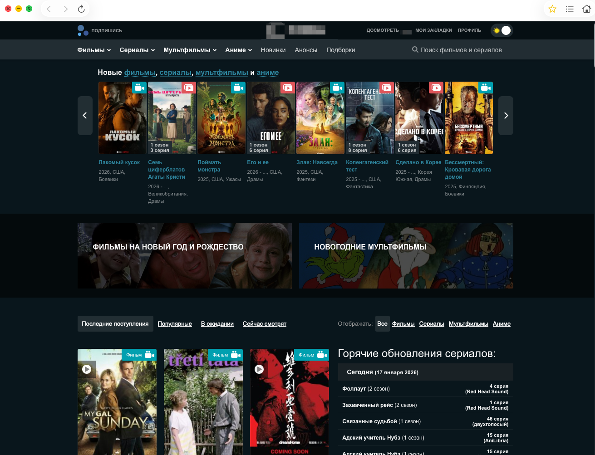

# 🎬 CinemaView

**CinemaView** — простое мультиплатформенное приложение для macOS и iOS, которое загружает сайт в WebView с отключённой рекламой и устранёнными визуальными отступами.  
Разработано в учебных целях с использованием SwiftUI и WKWebView.

---

## ✨ Возможности

- ✅ Мультиплатформенность: macOS и iOS
- ✅ Встроенный `WKWebView`
- ✅ Блокировка сетевых запросов к рекламным и аналитическим сервисам (`fetch` + `XHR`)
- ✅ Удаление визуальных отступов и рекламы с помощью `WKUserScript`
- ✅ Поддержка Developer ID для распространения вне Mac App Store
- ✅ Корректное завершение приложения при закрытии окна (macOS)

---

## 🧱 Используемые технологии

- SwiftUI + AppKit/UIKit (через `NSViewRepresentable`)
- `WKWebView` с кастомной конфигурацией
- `WKUserScript` для внедрения JavaScript и CSS
- Ручная настройка `Code Signing` под macOS (`Developer ID`)

## ⚠️ Disclaimer

Приложение разработано исключительно в **учебных целях**.  
Не связано с HDRezka и не предназначено для обхода платных сервисов.

---
